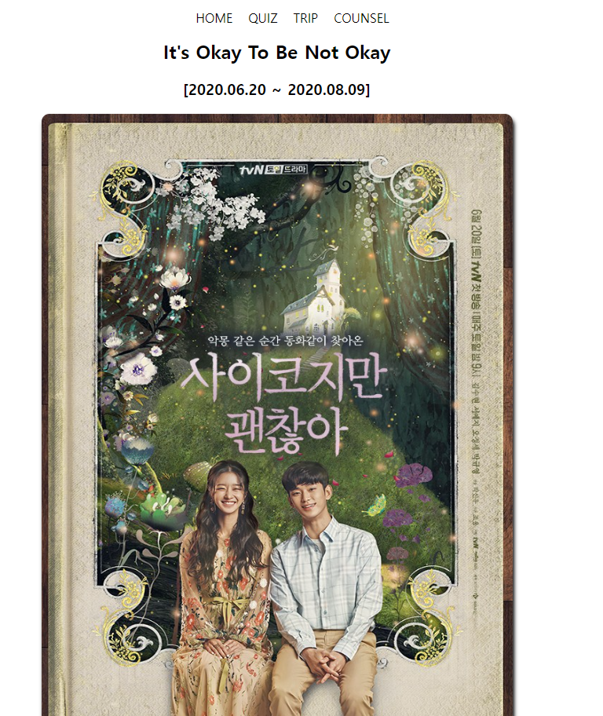

<!--
Hey, thanks for using the awesome-readme-template template.
If you have any enhancements, then fork this project and create a pull request
or just open an issue with the label "enhancement".

Don't forget to give this project a star for additional support ;)
Maybe you can mention me or this repo in the acknowledgements too
-->

<!--
This README is a slimmed down version of the original one.
Removed sections:
- Screenshots
- Running Test
- Deployment
- FAQ
-->

  <h1>It's okay to be Not okay</h1>
  <h2>사이코지만 괜찮아</h2>
  
  

    Next.js를 이용한 첫 프로젝트 입니다.
    <ul>
      - Server Component와 Client Component의 이해
      - App Router를 이용한 경로 처리 
      - Sever 와 Client 단에서 API와의 비동기 통신 경험
      - 장소 데이터를 입력하고 관리하는 CRUD 기능 구현
      - RESTful API 구현
      - 사용자 경험(UI/UX) 개선을 위해 그리드 레이아웃 및 반응형 디자인 적용
    </ul>

  

  

    해당 프로젝트 목적은 드라마 팬들에게 유용한 정보를 제공하는데 초점을 맞췄고, 향후 사용자 간의
    장소 공유 기능, 가능하다면 커뮤니티 페이지로도 발전시켜볼 계획입니다.

  

<!-- Table of Contents -->

# :notebook_with_decorative_cover: Table of Contents

- [Tech Stack](#space_invader-tech-stack)
- [Features](#dart-features)
- [Environment Variables](#key-environment-variables)
- [Getting Started](#toolbox-getting-started)

## :star2: About the Project

 
  
  

<!-- TechStack -->

### :space_invader: Tech Stack

  
Client

  <ul>
    <li><a href="https://nextjs.org/">Next.js</a></li>
    <li><a href="https://reactjs.org/">React.js</a></li>
  </ul>

  
Server

  <ul>
    <li><a href="https://nestjs.com/">Nest.js</a></li>
  </ul>

<!-- Features -->

### :dart: Features

드라마 속 장소 정보 제공

장소 추가, 삭제 기능

반응형 웹 디자인

TMDB API를 이용한 드라마 정보 제공

데이터 관리 (json-server)

<!-- Env Variables -->

### :key: Environment Variables

To run this project, you will need to add the following environment variables to your .env file

.env.local.example 참고해서 설정

- TMDB API KEY
  <strong>NEXT_PUBLIC_TMDB_API_KEY </strong>
- JSON_API_URL
<strong>NEXT_PUBLIC_DB_API_URL</strong>
<!-- Getting Started -->

## :toolbox: Getting Started

> development server
> `npm run dev `
> build
> `npm run build`
> start
> `npm run start`

